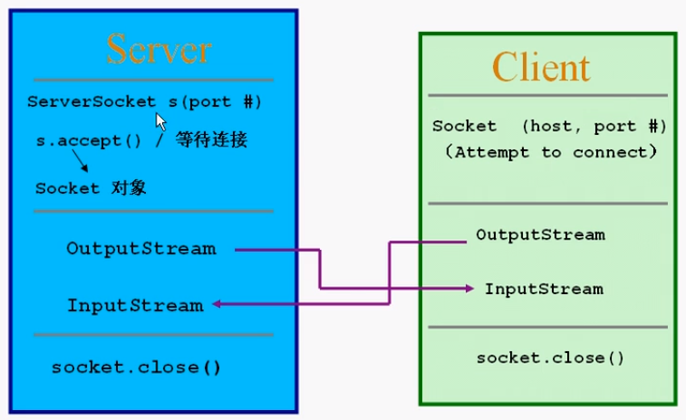

#### 本章内容
1.网络基础

2.TCP/IP协议

3.IP地址

4.Socket通信
+ TCP/UDP

#### Socket
1.两个Java应用程序可通过一个双向的网络通信连接实现数据交换，这个双向链路的一端称为一个Socket
2.Socket通常用来实现client-server连接
3.java.net包中定义的两个类Socket和ServerSocket，分别用来实现双向连接的client和server端
4.建立连接时所需的寻址信息为远程计算机的IP地址和端口号(Port number)

备注:

1.自己使用端口号尽量使用1024以上的，1024以下的一般系统就占用了
2.TCP端口和UDP端口是分开的，每一个有65536个端口

#### Socket通信模型

