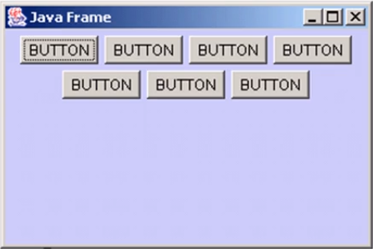
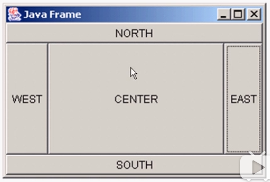
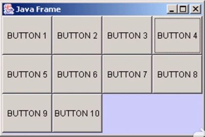

#### 本章内容
1.AWT

2.组件和容器

3.布局管理器

4.事件处理

5.Java图形

6.Window事件


#### AWT
1.AWT(Abstract Window Toolkit，抽象窗口开发包)包含了很多类和接口，用于Java Application的GUI(Graphic User Interface图形用户界面)编程

2.GUI的各种元素(如：窗口，按钮，文本框等)由Java类来实现

3.使用AWT所涉及的类一般在java.awt包及其自包中

4.Container和Component是AWT中的两个核心类


备注：

+ 新的开发包都是基于javax.swing，但是swing也离不开awt
+ 所有都能显示出来的图形元素都叫Component
+ Container，容纳其他Component的元素(也可以容纳Container)，叫做容器
+ Panel不能独立显示，可以把自己装在Window中显示
+ Dialog，对话框，一种叫模态(点掉才能进行下一步)，一种叫非模态(处理不处理，主窗口都能运行)


#### Component & Container
1.Java的图形用户界面的最基本组成部分是Component，Component类及其子类的对象用来描述以图形化的方式显示在屏幕上并能与用户进行交互的GUI元素，例如，一个按钮，一个标签等

2.一般的Component对象不能独立地显示出来，必须将"放在"某一的Container对象中才可以显示出来

3.Container是Component的子类，Component子类对象可以"容纳"别的Component对象

4.Container对象可使用方法add(..)向其中添加其他Component对象

5.Container是Component的子类，因此Container对象也可以被当作Component对象添加到其他Container对象中

6.有两种常用的Container:
+ Window：其对象表示自由停泊的顶级窗口
+ Panel：其对象可作为容纳其他Component对象，但不能独立存在，必须被添加到其他Container中(如Window或Applet)


#### Frame
1.Frame是Window的子类，由Frame或其子类创建的对象为一个窗体

2.Frame的常用构造方法
+ Frame()
+ Frame(String s) 创建标题栏为字符串s的窗口

```java
//设置窗体位置和大小，x，y是左上标坐标，width和height是宽度和高度
setBounds(int x, int y, int width, int height) 

//设置窗体的位置，x，y是左上角坐标
setSize(int width, int height)

//设置窗体的大小，width和height分别是宽度和高度
setLocation(int x, int y)

//设置背景颜色，参数为Color对象
setBackground(COlor c)

//设置是否可见
setVisible(boolean b)

//设置标题栏文字
setTitle(String name)

String getTitle() 

//设置是否可以调整大小
setResizable(boolean b)
  

```


#### Panel
1.Panel对象可以看成可以容纳Component的空间

2.Panel对象可以拥有自己的布局管理器

3.Panel类拥有从其父类继承来的
```java
setBounds(int x, int y, int width, int height)
setSize(int width, int height)
setLocation(int x, int y)
setBackground(Color c)
setLayout(LayoutManager mgr) 等方法
```

4.Panel的构造方法为
```java
Panel()   使用默认的FlowLayout类布局管理器初始化
Panel(LayoutManager layout)   使用指定的布局管理器初始化
```


#### 布局管理器
1.Java语言中，提供了布局管理器类的对象可以管理
+ 管理Component在Container中的布局，不必直接设置Component位置和大小
+ 每个Container都有一个布局管理器对象，当容器需要对某个组件进行定位或判断其大小尺寸时，就会调用其对应的布局管理器，调用Container的setLayout方法改变其布局管理器对象

2.Awt提供了5种布局管理器类：
+ FlowLayout
+ BorderLayout
+ GridLayout
+ CardLayout
+ GridBagLayout


#### FlowLayout布局管理器
1.FlowLayout是Panel类的默认布局管理器
+ FlowLayout布局管理器对组件追行定位，行内从左到右，一行排满后换行
+ 不改变组件的大小，按组件原有尺寸显示组件，可设置不同的组件间距，行距以及对其方式

2.FlowLayout布局管理器默认的对齐方式是居中



#### FlowLayout的构造方法
```java
//右对齐，组件之间水平间隔20个像素，垂直间隔40个像素
new FlowLayout(FlowLayout.RIGHT, 20, 40)

//左对齐，水平和垂直间隔距为缺省值（5）
new FlowLayout(FlowLayout.LEFT)

//使用缺省的居中对齐方式，水平和垂直间距为缺省值（5）
new FlowLayout();
```


#### BoradLayout布局管理器
1.BorderLayout是Frame类的默认布局管理器
2.BorderLayout将整个容器的布局划分成
+ 东(EAST)
+ 西(WEST)
+ 南(SOUTH)
+ 北(NORTH)
+ 中(CENTER)五个区域，组件只能被添加到指定的区域

3.如不指定组件的加入部位，则默认加入到CENTER区
4.每个区域只能加入一个组件，如加入多个，则先前加入的会被覆盖


#### BorderLayout布局管理器
BorderLayout型布局容器尺寸缩放原则：
+ 北、南两个区域在水平方向缩放
+ 东、西两个区域在垂直方向缩放
+ 中部可在两个方向上缩放



#### GridLayout布局管理器
1.GridLayout型布局管理器将空间划分为成规则的矩形网络，每个单元格区域大小相等。组件被添加到每个单元格中，先从左到右添满一行后换行，再从上到下
2.在GridLayout构造方法中指定分隔的行数和列数



#### 布局管理器总结
1.Frame是一个顶级窗口，Frame的缺省布局管理器为BoardLayout

2.Panel无法单独显示，必须添加到某个容器中
+ Panel的缺省布局管理器为FlowLayout

3.当把Panel作为一个组件添加到某个容器中后，该Panel仍然可以有自己的布局管理器
4.使用布局管理器时，布局管理器负责各个组件的大小和位置，因此用户无法在这种情况下设置组件的大小和位置属性，如果试图使用Java语言提供的setLocation(), setSize(), setBounds()


