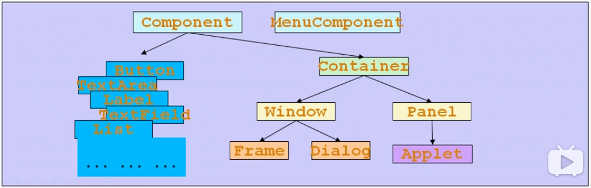

#### 本章内容
1.AWT

2.组件和容器

3.布局管理器

4.事件处理

5.Java图形

6.Window事件


#### AWT
1.AWT(Abstract Window Toolkit，抽象窗口开发包)包含了很多类和接口，用于Java Application的GUI(Graphic User Interface图形用户界面)编程

2.GUI的各种元素(如：窗口，按钮，文本框等)由Java类来实现

3.使用AWT所涉及的类一般在java.awt包及其自包中

4.Container和Component是AWT中的两个核心类



备注：

+ 新的开发包都是基于javax.swing，但是swing也离不开awt
+ 所有都能显示出来的图形元素都叫Component
+ Container，容纳其他Component的元素(也可以容纳Container)，叫做容器
+ Panel不能独立显示，可以把自己装在Window中显示
+ Dialog，对话框，一种叫模态(点掉才能进行下一步)，一种叫非模态(处理不处理，主窗口都能运行)


#### Component & Container
1.Java的图形用户界面的最基本组成部分是Component，Component类及其子类的对象用来描述以图形化的方式显示在屏幕上并能与用户进行交互的GUI元素，例如，一个按钮，一个标签等

2.一般的Component对象不能独立地显示出来，必须将"放在"某一的Container对象中才可以显示出来

3.Container是Component的子类，Component子类对象可以"容纳"别的Component对象

4.Container对象可使用方法add(..)向其中添加其他Component对象

5.Container是Component的子类，因此Container对象也可以被当作Component对象添加到其他Container对象中

6.有两种常用的Container:
+ Window：其对象表示自由停泊的顶级窗口
+ Panel：其对象可作为容纳其他Component对象，但不能独立存在，必须被添加到其他Container中(如Window或Applet)


#### Frame
1.Frame是Window的子类，由Frame或其子类创建的对象为一个窗体

2.Frame的常用构造方法
+ Frame()
+ Frame(String s) 创建标题栏为字符串s的窗口

```java
//设置窗体位置和大小，x，y是左上标坐标，width和height是宽度和高度
setBounds(int x, int y, int width, int height) 

//设置窗体的位置，x，y是左上角坐标
setSize(int width, int height)

//设置窗体的大小，width和height分别是宽度和高度
setLocation(int x, int y)

//设置背景颜色，参数为Color对象
setBackground(COlor c)

//设置是否可见
setVisible(boolean b)

//设置标题栏文字
setTitle(String name)

String getTitle() 

//设置是否可以调整大小
setResizable(boolean b)
  

```


