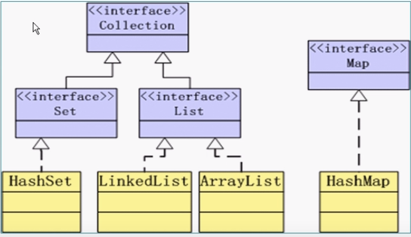

#### 容器API

1.J2SDk所提供的容器API位于java.util包内

2.容器API的类图节后如下图所示：



3.Colection接口定义了存取一组对象的方法，其子接口Set和List分别定义了存储方式
+ Set中的数据对象没有顺序且不可以重复(所谓的重复就是相互equals)
+ List中的数据对象有顺序且可以重复

4.Map接口定义了存储"键(key) —— 值(value)映射对"的方法

#### Collection接口

1.collection接口中所定义的方法

```Java
int size();
boolean isEmpty();
void clear();       //清空
boolean contains(Object element);
boolean add(Object element);
boolean remove(Object element);
Iterator iterator();
boolean containsAll(Collection c);
boolean addAll(Collection c);
boolean removeAll(Collecction c);
boolean retainAll(Collection c);   
Object[] toArray();

```

#### Collection方法举例
+ 容器类对象在调用remove、contains等方法时需要比较对象是否相等，这会涉及到对象类型的equals方法和hashCode方法；对于自定义的类型，需要重写equals和hashCode方法以实现自定义的对象相等规则
+ 注意：相等的对象应该具有相等的hashCode
+ 增加Name类的equals和hashCode方法如下：

```Java
public boolean equals(Object obj) {
    if (obj instanceOf Name) {
        Name name = (Name) obj;
        return (firstName.equals(name.firstName) &&
                (lastName.equals(name.lastName)));
    }
    return super.equals(obj);
}

public int hashCode() {
    return first.hashCode();
}
```


