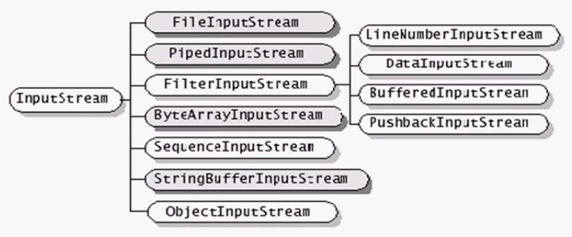
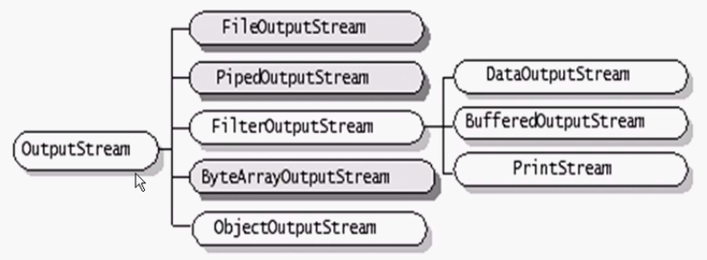
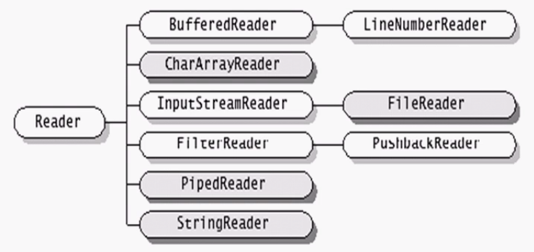
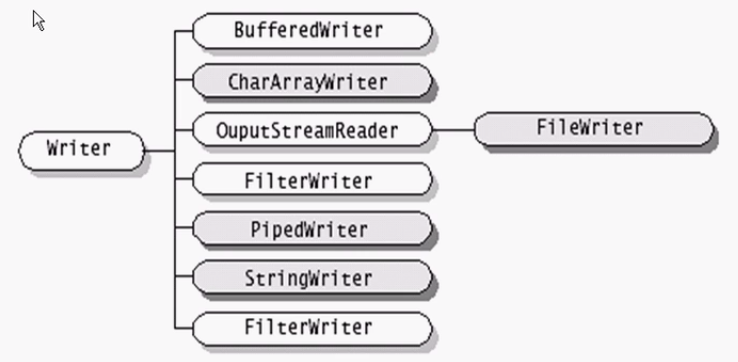
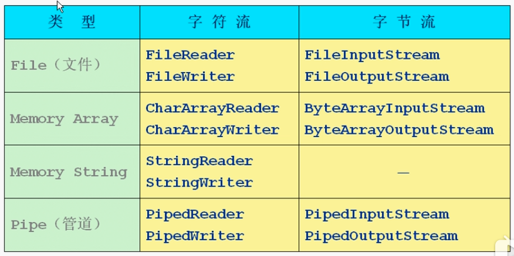
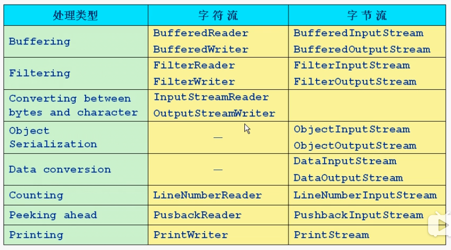
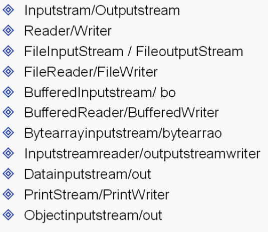

#### java流式输入/输出原理
在java程序中，对于数的输入/输出操作以"流"(stream)方式进行；J2SDK提供了各种各样的"流"类，用以获取不同种类的数据；程序中通过标准的方法输入或输出数据


#### 输入/输出流的分类
1.java.io包中定义了多个流类型(类或抽象类)来实现输入/输出功能；可以从不同的角度对其进行分类:

+ 按照数据流的方向不同可以分为输入流和输出流
+ 按照处理数据单位不同可以分为字节流和字符流
+ 按照功能不同可以分为及节点流和处理流

2.J2SDK所提供的所有流类型位于包java.io内都分别继承自以下四个抽象流类型

|   | 字节流 | 字符流 |

| -- | -- | -- |

| 输入流 | InputStream |  Reader |

| 输出流 | OutputStream | Writer | 

#### 节点流和处理流

+ 节点流可以从一个特定的数据源(节点)读写数据(如：文件，内存)
+ 处理流是"连接"在已存在的流(节点流或处理流)之上，通过对数据的处理为程序提供更为强大的读写功能

#### InputStream

继承自InputStream的流都是用于向程序中输入数据，且数据的单位为字节(8 bit)；下图中深色为节点流，浅色为处理流


#### InputStream的基本方法
```java
//读取一个字节并以整数的形式返回(0-255)，如果返回-1已到输入流的末尾
int read() throws IOException

//读取一系列字节并存储到一个数组buffer，返回实际读取的字节数，如果读取前已到输入流的末尾返回-1
int read(byte[] buffer) throws IOException

//读取length个字节，并存储到一个字节数组buffer，从length位置开始，返回实际读取的字节数，如果读取前已到输入流的末尾返回-1
int read(byte[] buffer, int offset, int length) throws IOException

//关闭流释放内存资源
void close() throws IOException

//跳过n个字节不读，返回实际跳过的字节数
long skip(long n) throws IOException
```


#### OutputStream
继承自OutputStream的流是用于程序中输入数据，且数据的单位为字节(8 bit)；下图中深色为节点流，浅色为处理流




#### OutPutStream的基本方法
```java
//向输出流中写入一个字节数据，该字节数据为参数b的低8位
void write(int b) throws IOException

//将一个字节类型的数组中的数据写入输出流
void write(byte[] b) throws IOException

//将一个字节类型的数组中的从指定位置(off)开始的len个字节写入到输出流
void write(byte[] b, int off, int len) throws IOException

//关闭流释放内存资源
void close() throws IOException

//将输出流中缓冲的数据全部写出到目的地
void flush() throws IOException
```


#### Reader
继承自Reader的流都是用于向程序中输入数据，且数据的单位为字符(16 bit)；下图中深色为节点流，浅色的为处理流




#### Reader的基本方法
```java
//读取一个字符并以整数的形式返回(0-255)，如果返回-1已到输入流的末尾
int read() throws IOException

//读取一系列字符并存储到一个数组buffer，返回实际读取的字符数，如果读取前已到输入流的末尾返回-1
int read(char[] cbuf) throws IOException

//读取length个字符并存储到一个数组buffer，从length位置开始，返回实际读取的字符数，如果读取前已到输入流的末尾返回-1
int read(char[] cbuf, int offset, int length) throws IOException

//关闭流释放内存资源
void close() throws IOException

//跳过n个字符不读，返回实际跳过的字节数
long skip(long n) throws IOException
```


#### Writer
继承自Writer的流都是用于程序中输入数据，且数据的单位为字符(16 bit)；下图中深色为节点流，浅色为处理流




#### Writer的基本方法
```java
//向输出流中写入一个字符数据，该字节数据为参数b的低16位
void write(int c) throws IOException

//将一个字符类型的数组中的数据写入输出流
void write(char[] cbuf) throws IOException

//将一个字符类型的数组中的从指定位置(offset)开始的length个字符写入到输出流
void write(char[] cbuf, int offset, int length) throws IOException

//将一个字符串中的字符写入到输出流
void write(String string) throws IOException

//将一个字符串从offset开始的length个字符写入到输出流
void write(String string, int offset, int length) throws IOException

//关闭流释放内存资源
void close() throws IOException

//将输出流中缓冲的数据全部写出到目的地
void flush() throws IOException
```   

#### 节点流类型




#### 处理流类型




#### 缓冲流
1.缓冲流要"套接"在相应的节点流之上，对读写的数据提供了缓冲的功能，提高了读写的效率，同时增加了一些新的方法
2.J2SDK提供了四种缓冲流，其常用的构造方法为:
```java
BufferedReader(Reader in)
BufferedReader(Reader in, int sz)  //sz 为自定义缓存区的大小
BufferedWriter(Writer out)
BufferedWriter(Writer out, int sz) 
BufferedInputStream(InputStream in)
BufferedInputStream(InputStream in, int size)
BufferedOutputStream(OutputStream out) 
BufferedOutputStream(OutputStream out, int size)
```

+ 缓冲输入流支持其父类的mark和reset方法
+ BufferedReader提供了readLine方法用于读取一行字符串(以\r或\n分隔)
+ BufferedWriter提供了newLine用于写入一个行分隔符
+ 对于输出的缓冲流，写出的数据会先在内存中缓存，使用flush方法将会使内存中的数据立即写出


#### 转换流
+ InputStreamReader和OutputStreamWriter用于字节数据到字符数据之间的转换
+ InputStreamReader需要和InputStream"套接"
+ OutputStreamWriter需要和OutputStream"套接"
+ 转换流在构造是可以指定其编码集合，例如
```java
InputStream isr = new InputStreamReader(System.in, "ISO8859_1")
```


#### 数据流
+ DataInputStream和DataOutStream分别继承自InputStream和OutStream，属于处理流，分别"套接"在InputStream和OutputStream类型的节点流上
+ DataInputStream和DataOutputStream提供了可以存取与机器无关的Java原始类型数据(如：int, double等)的方法
+ DataInputStream和DataOutStream的构造方法为:

    + DataInputStream (InputStream in)
    + DataOutputStream (OutputStream out)
    
    
#### Print流 打印流
+ PrintWriter和PrintStream都属于输出流，分别针对于字符和字节
+ PrintWriter和PrintStream提供了重载的print
+ Println的方法用于多种数据类型的输出
+ PrintWriter和PrintStream的输出操作都不会抛出异常，用户通过检测错误状态获取错误信息
+ PrintWriter和PrintStream有自动flush功能

```java
PrintWriter(Writer out)
PrintWriter(Writer out, boolean autoFlush)
PrintWriter(OutputStream out)
PrintWriter(OutStream out, boolean autoFlush)
PrintStream(OutStream out)
PrintStream(OutStream out, boolean autoFlush)
```


#### Object流
1.直接将Object写入或读出

    + TestObjectIO.java
    + transient关键字
    + serizalizable接口，标记类可以序列化，jdk自动序列化
    + externalizable接口，实现其两个方法，自己可以控制jdk的序列化过程
    

#### 总结



