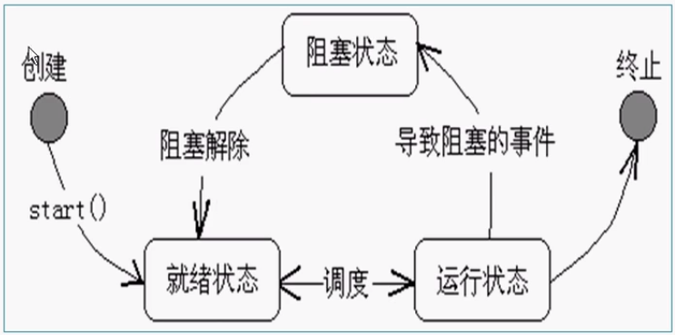

#### 线程的基本概念
1.线程是一个程序内部的顺序控制流

2.线程和进程的区别

+ 每个进程都有独立的代码和数据空间(进程上下文)，进程间的切换会有较大的开销
+ 线程可以看成是轻量级的进程，同一类线程共享代码和数据空间，每个线程有独立的运行栈和程序计数器(PC),线程切换的开销小
+ 多进程：在操作系统中能同时运行多个任务(程序)
+ 多线程：在同一应用程序中有多个顺序流同时执行

3.Java的线程是通过java.lang.Thread类来实现

4.VM启动时会有一个由主方法(pubic static void main() {}) 所定义的线程

5.可以通过创建Thread的实例来创建新的线程

6.每个线程都是通过某个特定Thread对象所对应的方法run()来完成其操作的，方法run()称为线程体

7.通过调用Thread类的start()方法来启动一个线程

注意：

1.进程是一个静态的概念，一个ppt是进程，一个exe也是进程

2.一个进程里有一个主线程，叫main方法，是一个程序，一个进程里不同的执行路径，目前我们学到的只有一个主线程

3.在同一个时间点上，一个cpu只能支持一个线程在执行，只不过它速度很快，看起来就像多线程一样。什么叫真正的多线程，你的机器如果是双cpu，或者双核，这个确确实实是多线程


#### 线程的创建和启动
1.可以有两种方式创建新的线程

+ 第一种
    + 定义线程类实现Runnable接口
    + Thread myThread = new Thread(target)   //target为Runnable接口类型
    + Runnable中只有一个方法：
        + public void run();  用以定义线程运行体
    + 使用Runnable接口可以为多个线程提供共享的数据
    + 在实现Runnable接口的类型的run方法定义中可以使用Thread的静态方法
        + public static Thread currentThread()   获取当前线程的引用
        
+ 第二种
    + 可以定义一个Thread的子类并重写其run方法如：
        ```java
        class MyThread extends Thread() {
          public void run() {..}
        }
        ```
    + 然后生成该类的对象：
        ```java
       Mythread myThread = new MyThread(...)
        ```

#### 线程状态转换




#### 线程控制的基本方法
```java
isAlive()       判断线程是否还"活"着，即线程是否还未终止
getPriority()   获得线程的优先级数值
setPriority()   设置线程的优先级数值
Thread.sleep()  将当前线程睡眠指定毫秒数
join()          调用某线程的该方法，将当前线程与该线程"合并"，即等待该线程结束，再恢复当前线程的运行
yield()         让出CPU,当前线程进入就绪队列等待调度
wait()          当前线程进入对象的wait pool
notify()/notifyAll()   唤醒对象的wait pool中的一个/所有等待线程
```


#### sleep/join/yield方法
1.sleep方法
+ 可以调用Thread的静态方法

  public static void sleep(long millis) throws InterruptedException
  
  使得当前线程休眠(暂时停止执行millis毫秒)
  
+ 由于是静态方法，sleep可以由类名直接调用
  Thread.sleep() 
  
2.join方法
+ 合并某个线程

3.yield方法
+ 让出CPU，给其他线程执行的机会


#### 线程的优先级别
1.Java提供一个线程调度器来监控程序中启动后进入就绪状态的所有线程，线程调度器按照线程的优先级决定应调度哪个线程来执行
2.线程的优先级用数字表示，范围从1到10，一个线程的缺省优先级是5
+ Thread.MIN_PRIORTYI = 1
+ Thread.MAX_PRIORITY = 10
+ Thread.NORM_PRIORITY = 5

3.使用下述方法获得或设置线程对象的优先级
+ int getPriority();
+ void setPriority(int newPriority);


#### 线程同步
1.在Java语言中，引入了对象互斥锁的概念，保证共享数据操作的完整性。每个对象都对应于一个可称为"互斥锁"的标记，这个标记保证在任一时刻，只能有一个线程访问该对象
2.关键字synchronized来与对象的互斥锁联系。当某个对象synchronized修饰时，表明该对象在任一时刻只能由一个线程访问
+ synchronized的使用方法
```java
synchronized(this) {
    num ++;
    try {
        Thread.sleep(1);
    } catch (InterruptedException e) {
        System.out.println(name + ", 你是第" + num +"个使用timer的线程");
    }
}
```
+ synchronized还可以放在方法声明中，表示整个方法为同步方法，例如:
```java
public synchronized void add(String name) {...}
```


